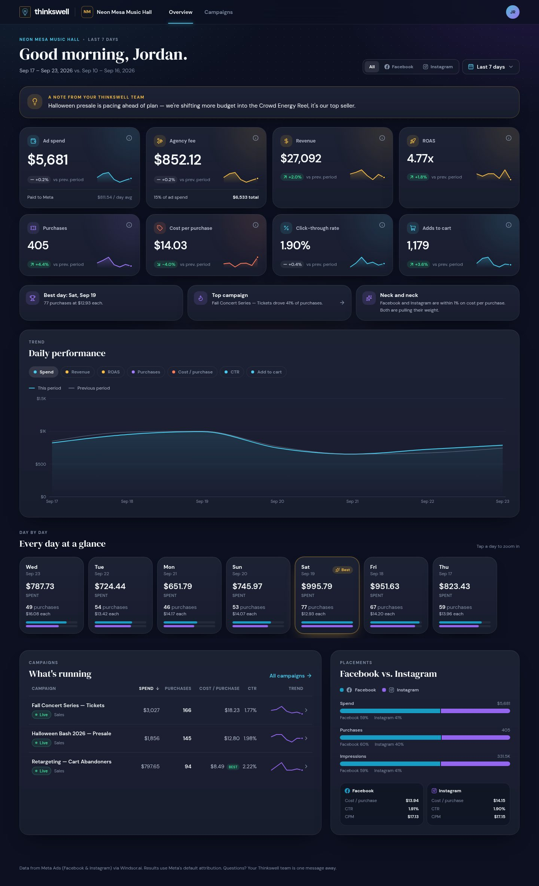
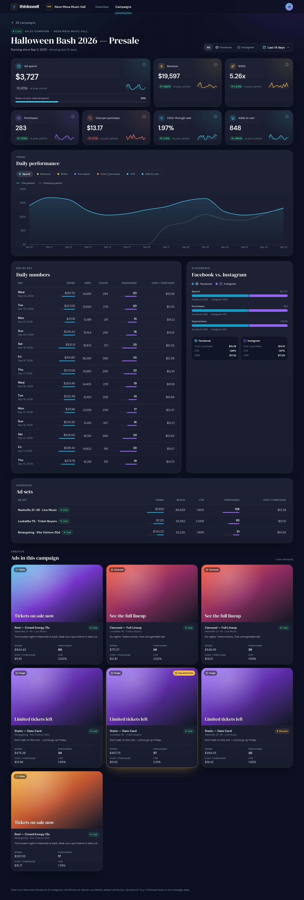
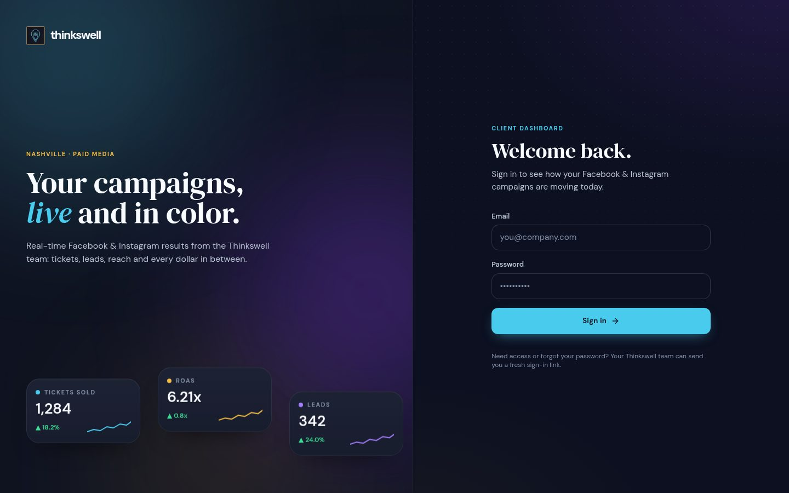
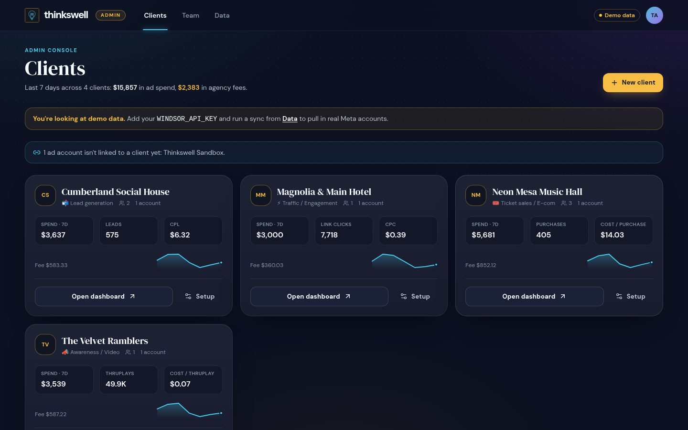
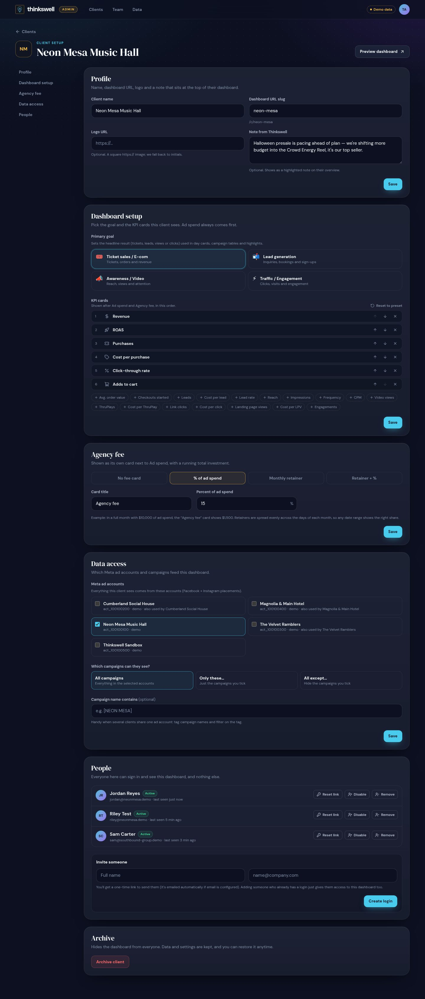
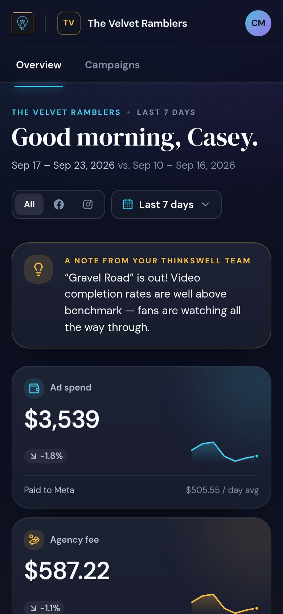

# Thinkswell Ads Dashboard

A branded client portal for Thinkswell's paid-media clients. Each client logs in and sees
their Facebook + Instagram results by day, with KPI cards, a trend chart, day cards and
campaign drill-downs. Meta data flows in from **Windsor.ai**.

See **[SPEC.md](./SPEC.md)** for the full product spec: roles, setups, agency fee math,
data pipeline and roadmap.

| Client overview | Campaign detail |
|---|---|
|  |  |

| Sign in | Admin: clients | Admin: client setup | Mobile |
|---|---|---|---|
|  |  |  |  |

## Quick start (local, no database needed)

```bash
npm install
npm run setup     # migrates the embedded DB and loads 120 days of demo data
npm run dev       # http://localhost:3000
```

Demo logins (password `thinkswell-demo`):

| Who | Email | Sees |
|---|---|---|
| Thinkswell admin | `admin@thinkswell.demo` | Everything + admin console |
| Music venue (ticket sales) | `jordan@neonmesa.demo` | Neon Mesa Music Hall |
| Event space (lead gen) | `priya@cumberlandsocial.demo` | Cumberland Social House |
| Artist (awareness/video) | `casey@velvetramblers.demo` | The Velvet Ramblers |
| Hotel (traffic) | `avery@magnoliamain.demo` | Magnolia & Main Hotel |
| Group owner (2 clients) | `sam@southbound-group.demo` | Neon Mesa + Cumberland (switcher) |
| Event promoter (1 group) | `morgan@halloweenbash.demo` | Only Neon Mesa's "Halloween Bash 2026" group |

The demo also shows campaign groups (tabs), client-friendly campaign names and mixed goals:
Cumberland's "Brand Awareness" group is measured on video, and The Velvet Ramblers' "Tour
Tickets" campaign is measured on ticket sales.

Local data lives in `.data/pglite` (git-ignored). Delete that folder and re-run
`npm run setup` to start fresh.

## Going live: Vercel + Supabase + Windsor

**Vercel project:** `thinkswell-advertising-dashboard` in the Thinkswell team
(`timthinkswellcs-projects`), linked to this repo. Every push to the production branch
deploys to https://thinkswell-advertising-dashboard.vercel.app. `AUTH_SECRET`,
`CRON_SECRET`, `APP_TIMEZONE` and `SYNC_LOOKBACK_DAYS` are already set there.
Still needed: `DATABASE_URL` (Supabase) and `WINDSOR_API_KEY`, then a redeploy.

1. **Supabase:** create a project. In *Connect*, choose the **Shared Pooler** in
   transaction mode and copy that connection string. It looks like
   `postgresql://postgres.<ref>:<password>@aws-…-us-east-1.pooler.supabase.com:6543/postgres`.
   Don't use the direct or Dedicated Pooler strings (`db.<ref>.supabase.co`): they're
   IPv6-only and Vercel can't reach them.
2. **Migrate + first admin** (from your machine, pointing at Supabase):
   ```bash
   DATABASE_URL="postgresql://…:6543/postgres" \
   ADMIN_EMAIL=you@thinkswell.com ADMIN_PASSWORD='a-long-password' ADMIN_NAME='Your Name' \
   npm run db:seed
   ```
3. **Vercel:** import the repo and set environment variables (see `.env.example`):
   - `DATABASE_URL`: the Supabase pooler URL
   - `AUTH_SECRET`: `openssl rand -base64 48`
   - `WINDSOR_API_KEY`: from Windsor → Settings
   - `CRON_SECRET`: any long random string (Vercel Cron sends it automatically)
   - optional: `APP_URL`, `APP_TIMEZONE` (default `America/Chicago`), `SYNC_LOOKBACK_DAYS`,
     `WINDSOR_ATTRIBUTION_WINDOW`, `RESEND_API_KEY` + `EMAIL_FROM`
4. Deploy, sign in, go to **Admin → Data** and click **Backfill 90 days**.
5. **Admin → Clients → New client**: pick the goal, link the ad account(s), set the agency
   fee, and invite the client's team. Send them the invite link, or it's emailed if Resend
   is configured.

The daily cron (`vercel.json`, 11:00 UTC ≈ 6am Central) re-pulls the last
`SYNC_LOOKBACK_DAYS` days. On a Vercel Pro plan you can make it hourly
(`"0 * * * *"`).

## Scripts

| Command | What it does |
|---|---|
| `npm run dev` | Dev server |
| `npm run setup` | Migrate + seed admin + demo clients/data (local) |
| `npm run db:seed` | Migrate + create the first admin from `ADMIN_*` env vars |
| `npm run db:migrate` | Apply migrations in `drizzle/` |
| `npm run db:generate` | Generate a migration after editing `src/lib/db/schema.ts` |
| `DATABASE_URL=… npm run db:migrate` | Apply new migrations to Supabase (use the pooler URL) |
| `npm run sync -- --days 30` | Pull from Windsor (or refresh demo data) from the CLI |
| `npm run typecheck` / `npm run lint` / `npm run build` | Checks |

## Project layout

```
src/
  app/
    login/, welcome/[token]/     sign in, set password from invite/reset link
    c/[slug]/                    client dashboard: overview, campaigns, campaign detail
    admin/                       clients, client setup, team, data
    api/cron/sync/               scheduled Windsor sync (Vercel Cron)
    actions/                     server actions (auth, admin)
  components/                    UI: KPI cards, charts, day cards, tables, admin forms
  lib/
    auth/                        sessions (jose), passwords (bcrypt), invite tokens, guards
    db/                          Drizzle schema + Postgres/PGlite connection
    metrics/                     metric catalog, goal presets, fee math, scoped queries
    sync/                        Windsor + demo sync jobs
    windsor/                     Windsor.ai API client
  proxy.ts                       optimistic auth redirect
drizzle/                         SQL migrations
scripts/                         seed / migrate / sync CLIs
```
